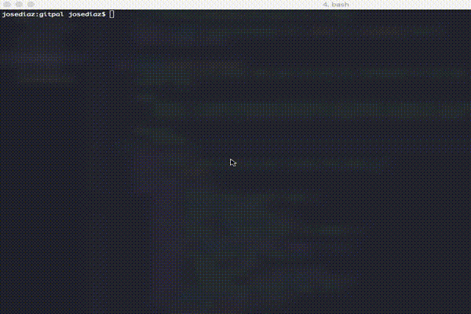

# Gitpal

Gitpal is a CLI tool that allows recording side project ideas
by automatically creating a github repository with provided notes and
scaffolding.

## Motivation

Say you suddenly come up with a cool idea for your next side
project comes up! What do you do? Well, you could make a note of it somewhere in
your computer. Of course, you risk forgetting where you wrote it. Maybe not,
maybe you are super disciplined and organized. However, Are you disciplined
enough to come back to that local folder or random text file you wrote? If the
answer is no, then **Gitpal** is your solution.

**GitPal will automatically create a github repository for you such that you are
forced to work on your idea.** At the very least you'll have a reliable place to
store it.

